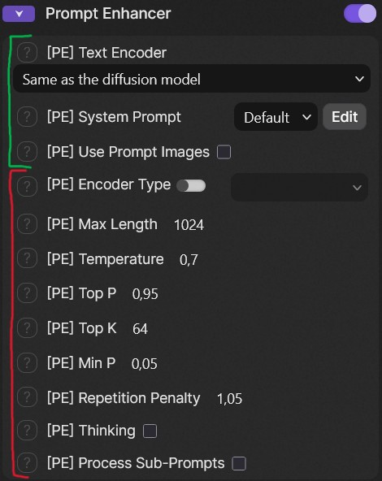

# SwarmUI Prompt Enhancer

Most diffusion models come with a LLM text encoder nowadays, 
ComfyUI now has an efficient `Generate Text` node (like ~95% as fast as llama.cpp on optimized models), 
but SwarmUI doesn't yet have a way to use it in Generate tab.

This extension fills this gap, letting you use any LLM from your text encoder directory as a prompt enhancer
from the Generate tab of Swarm. As it relies on Comfy only, you benefits from smart offloading, dynamic vram stuff, etc. 
instead of having to deal with an external inference engine that will then fight with Comfy for your vram.

The default mode is to reuse the diffusion model's text encoder if it's a LLM, saving some time and moving weights around.

System prompts library can be managed with the `Edit` button, some LLMs in Comfy have a weird handling of the 
chat template, so might not work with every model.

`Use Prompt Images` send the reference images of your prompt to the `Generate Text`, can be useful for Edit models.

Default sampling values should be sensible for most models, and are accessible with **Advanced Options** toggled on.

*base / advanced params*

## Usage

### During generation

Enable the **Prompt Enhancer** group in the parameters column, set your params, then generate. 

The prompt enhancement happens inside the generation workflow: the generated text is plugged into the prompt encoder node, 
and is saved to the image metadata as `enhanced_prompt` alongside your original `prompt`.

### Pre-Generation

The `✨ PE Enhance` button at the top-left of the prompt box rewrites the prompt in place, without
generating an image. Only the text before the first `<tag>` is rewritten; sections, LoRAs and wildcards after it are kept as-is.
Prompt images are sent too when `Use Prompt Images` is on.

## Notes

- Negative prompts are never rewritten.
- Sections Swarm appends to the prompt for a given stage (`<base>`, `<refiner>`, `<segment>`) are
  kept out of the enhancement: the global prompt is enhanced once, reused by every stage, and the
  section is appended after it (itself enhanced separately if `Process Sub-Prompts` on).
- The generation seed follows your Wildcard Seed when set, and the image seed otherwise.

## License

Do whatever you want with this, Opus did most of it in the first place.